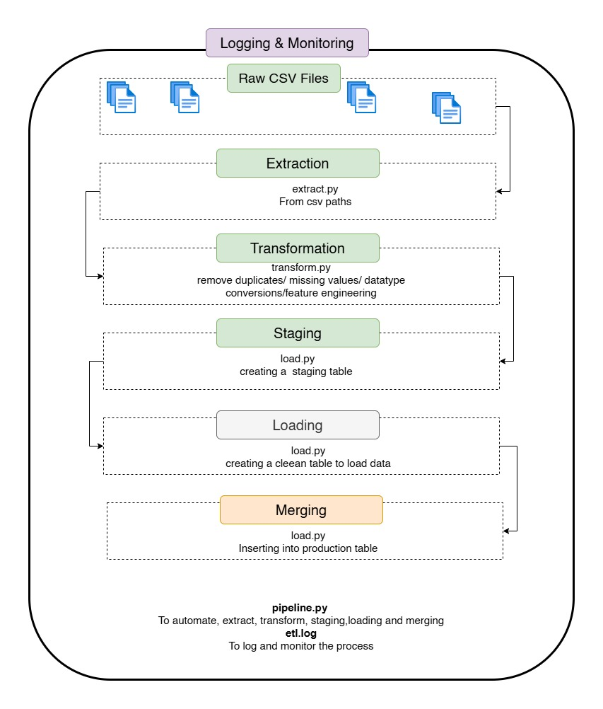

# CSV → PostgreSQL ETL Pipeline

A production-inspired ETL (Extract, Transform, Load) pipeline built with Python, Pandas, and PostgreSQL. This project demonstrates core data engineering concepts including data ingestion, transformation, validation, bulk loading, staging table architecture, logging, error handling, and environment-based configuration management.

---

## 📌 Project Overview

Organizations often receive operational data in CSV format that must be cleaned, transformed, and loaded into a database for analytics and reporting.

This project simulates a real-world data engineering workflow by:

* Extracting sales data from CSV files
* Cleaning and validating incoming records
* Transforming data into an analytics-ready format
* Loading data into PostgreSQL
* Using a staging table for scalable ingestion
* Handling duplicate records safely
* Logging pipeline execution for monitoring and troubleshooting

---

## 🏗️ Architecture

<p align="center">
  
</p>

<p align="center">
  <em>Production-inspired ETL workflow using Python, Pandas, and PostgreSQL.</em>
</p>

---

## 📂 Project Structure

```text
csv-postgres-etl/
│
├── data/
│   ├── raw/
│   │   └── sales.csv
│   │
│   └── processed/
│
├── logs/
│   └── etl.log
│
├── sql/
│   └── create_tables.sql
│
├── src/
│   ├── extract.py
│   ├── transform.py
│   ├── load.py
│   └── pipeline.py
│
├── .env
├── .gitignore
├── requirements.txt
└── README.md
```

---

## ⚙️ ETL Process

### 1. Extract

The extraction layer reads raw CSV files into Pandas DataFrames.

**Responsibilities**

* Read source files
* Validate file availability
* Prepare data for transformation

---

### 2. Transform

The transformation layer cleans and enriches the dataset.

#### Data Cleaning

* Remove duplicate records
* Remove rows with missing customer names
* Fill missing dates
* Convert date columns to datetime format

#### Feature Engineering

A new metric is generated:

```python
total_amount = quantity * price
```

This prepares the dataset for downstream reporting and analytics.

---

### 3. Load

The transformed dataset is loaded into PostgreSQL using a production-style loading strategy.

#### Initial Approach

```python
for _, row in df.iterrows():
    cur.execute(...)
```

While simple, row-by-row insertion becomes inefficient as data volume grows.

#### Optimized Approach

The pipeline uses PostgreSQL's `COPY` command with an in-memory `StringIO` buffer for high-performance bulk loading.

**Benefits**

* Significantly faster than individual inserts
* Efficient for large datasets
* Commonly used in enterprise ETL systems

---

## 🗄️ Database Design

### Production Table

```sql
CREATE TABLE sales (
    order_id INT PRIMARY KEY,
    customer_name VARCHAR(100),
    product VARCHAR(100),
    quantity INT,
    price NUMERIC(10,2),
    total_amount NUMERIC(10,2),
    order_date DATE
);
```

### Staging Table

```sql
CREATE TABLE sales_staging (
    order_id INT,
    customer_name VARCHAR(100),
    product VARCHAR(100),
    quantity INT,
    price NUMERIC(10,2),
    total_amount NUMERIC(10,2),
    order_date DATE
);
```

---

## 🚀 Performance Improvements

### Staging Table Architecture

Instead of loading directly into the production table:

1. Data is bulk-loaded into a staging table.
2. Records are validated and prepared.
3. Data is merged into the production table.

```sql
INSERT INTO sales
SELECT *
FROM sales_staging
ON CONFLICT (order_id)
DO NOTHING;
```

### Why This Matters

* Supports large-scale data ingestion
* Prevents duplicate records
* Enables future data quality checks
* Provides a foundation for incremental loading strategies

This pattern is commonly used in modern data engineering platforms and data warehouses.

---

## 🔒 Environment Configuration

Database credentials are stored using environment variables instead of hardcoding sensitive information.

### `.env`

```env
DB_HOST=localhost
DB_PORT=5432
DB_NAME=sales_db
DB_USER=postgres
DB_PASSWORD=my_password
```

### Benefits

* Improved security
* Environment portability
* Easier deployment
* Prevents secrets from being committed to source control

---

## 📋 Logging

Pipeline execution details are written to:

```text
logs/etl.log
```

Example:

```text
2026-06-03 10:00:01 - INFO - Extraction Started
2026-06-03 10:00:02 - INFO - Transformation Completed
2026-06-03 10:00:03 - INFO - Loading Started
2026-06-03 10:00:05 - INFO - Pipeline Completed
```

Logging supports:

* Monitoring
* Troubleshooting
* Operational visibility
* Auditability

---

## 🛡️ Error Handling

The load process includes:

* Transaction management
* Rollback support
* Connection cleanup
* Exception handling

These practices ensure data consistency and prevent partial database writes.

---

## 🧰 Technology Stack

| Category                 | Technology            |
| ------------------------ | --------------------- |
| Programming Language     | Python                |
| Data Processing          | Pandas                |
| Database                 | PostgreSQL            |
| Database Driver          | psycopg2              |
| Configuration Management | python-dotenv         |
| Version Control          | Git & GitHub          |
| Logging                  | Python Logging Module |

---

## 🎯 Skills Demonstrated

This project demonstrates practical experience in:

* Data Engineering Fundamentals
* ETL Pipeline Development
* Python Programming
* Data Cleaning & Validation
* SQL Development
* PostgreSQL Administration
* Batch Processing
* Feature Engineering
* Bulk Data Loading
* Database Optimization
* Error Handling
* Logging & Monitoring
* Environment Configuration Management
* Project Organization & Software Engineering Best Practices

---

## 🔮 Future Enhancements

Potential improvements include:

* Apache Airflow orchestration
* Docker containerization
* Automated testing with PyTest
* Data quality validation framework
* Incremental loading strategies
* Cloud storage integration
* Data warehouse implementation
* CI/CD pipelines
* Data lineage tracking
* Monitoring dashboards

---

## 📈 Learning Outcomes

Through this project, I gained hands-on experience designing and implementing a complete ETL workflow using Python and PostgreSQL. The project incorporates foundational data engineering concepts and follows patterns commonly used in production environments, including bulk loading, staging tables, configuration management, logging, and transactional database operations.

---

## 👨‍💻 Author

**Derrick Nyongesa**

Electrical & Electronics Engineer | Data Engineer | Machine Learning Enthusiast

### Connect With Me

* LinkedIn: https://www.linkedin.com/in/derrick-nyongesa
* GitHub: https://github.com/DECTEN0

If you found this project useful, feel free to connect, provide feedback, or contribute to the repository.
